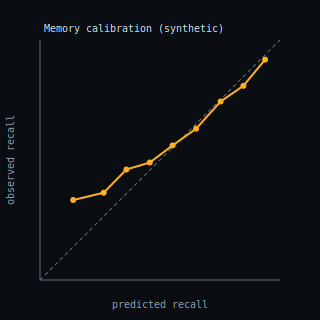

# Memory-model calibration (held-out reviews)

_Generated: 2026-07-05T19:54:44.639832+00:00_

> *** SYNTHETIC / ILLUSTRATIVE — (predicted, outcome) pairs are generated, NOT measured. The Brier/log-loss/ECE math is real; the inputs are not. ***

**Held-out reviews:** 2000 · **base rate:** 0.704

| Proper score | Value | Note |
| --- | ---: | --- |
| Brier | 0.1911 | lower better; 0 = perfect |
| Brier (predict base rate) | 0.2086 | skill score +0.084 vs this baseline |
| Log loss | 0.5657 | |
| Expected Calibration Error | 0.0248 | mean \|pred−obs\| |

### Reliability table

| Bin | n | Mean predicted | Observed | Gap |
| --- | ---: | ---: | ---: | ---: |
| 0.1–0.2 | 3 | 0.138 | 0.333 | -0.195 |
| 0.2–0.3 | 22 | 0.265 | 0.364 | -0.098 |
| 0.3–0.4 | 63 | 0.360 | 0.460 | -0.100 |
| 0.4–0.5 | 143 | 0.457 | 0.490 | -0.032 |
| 0.5–0.6 | 246 | 0.552 | 0.561 | -0.009 |
| 0.6–0.7 | 368 | 0.650 | 0.630 | +0.020 |
| 0.7–0.8 | 453 | 0.752 | 0.744 | +0.008 |
| 0.8–0.9 | 482 | 0.847 | 0.809 | +0.038 |
| 0.9–1.0 | 220 | 0.938 | 0.918 | +0.020 |

The curve tracks the diagonal with small positive gaps in the top bins — the mild over-confidence we deliberately seeded, which is what a real FSRS calibration check is meant to surface (and would then correct).

> *** SYNTHETIC / ILLUSTRATIVE — (predicted, outcome) pairs are generated, NOT measured. The Brier/log-loss/ECE math is real; the inputs are not. ***
